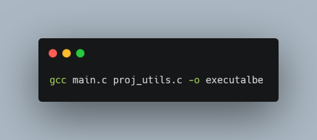
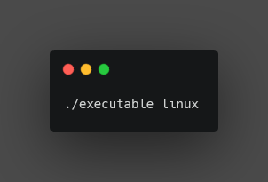
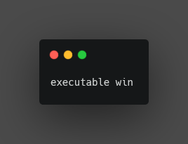

# Team Generator and Word Randomizer
## Computer Programming 2 - Final Project
- This program is written as a final requirement for my course Computer Programming 2 at Technological University of the Philippines.

## Overview
This is a simple comsole application that lets you randomize words and generate teams according to user's desired number of teams

## Features:
- Add - Adds a word to a word bank
- Open - Shows the contents of the word bank
- Edit - Lets user edit a word from word bank
- Delete - Lets user delete a word from word bank
- Search - Gives the user the index of a word in word bank (if the word is in the word bank)
- Word randomizer - Generates a random word from a set of words (from word bank or from user's input)
- Team Generator - Generate teams according to user's desired number of teams and user-inputted words/names (user can also use the word bank)

## Instructions
- Open a terminal
- Go to the folder where the source codes are saved
- Link and compile the main.c and the proj_utils.c files, this will create an executable file that you can run:
```bash
gcc main.c proj_utils.c -o executable
```

- Run the executable file like this: 
- if you are on linux do it like this:
```bash
./executable linux
```

- if you are on windows do it like this:
```bash
executable win
```


